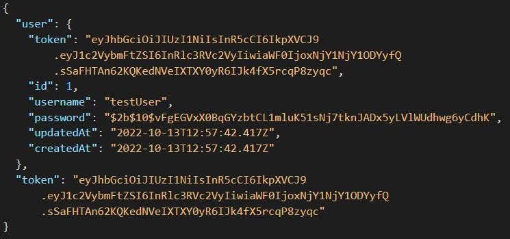

# LAB - 07

## Deployment Test

- [Test Report](https://github.com/dftjr/bearer-auth/actions)
- [Heroku](https://dftjr-bearer-auth.herokuapp.com/)

### Author: 

David Tusia

### Setup

- <code>.env</code> - Required
  - <code>PORT</code> - Port Number

### Running the app

- <code>nodemon</code> - Start server
- Endpoints:
  - <code>/signup</code>
    - Returns:
       
      
  
  - <code>/signin</code>
  - <code>/users</code>
  - <code>/secret</code>

### Tests

- Unit Tests: <code>npm test</code>

### UML

<code>place UML here</code>
